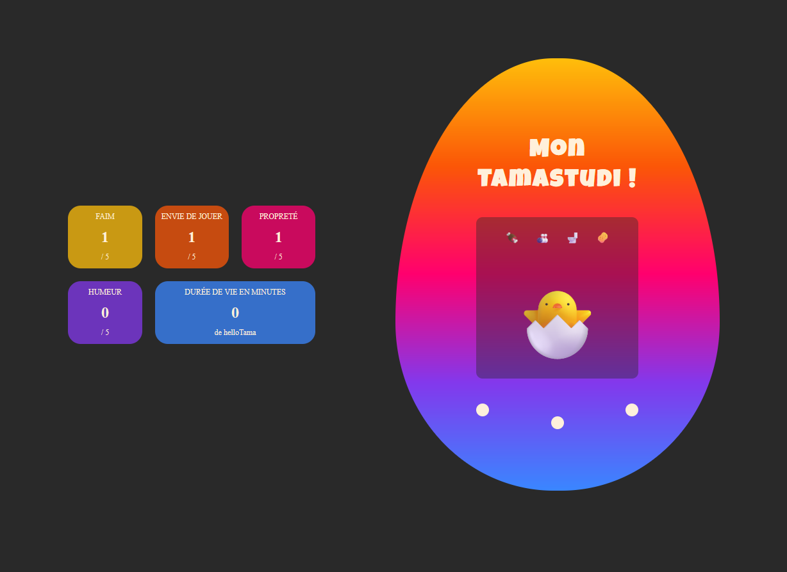

# Tamastudi

## Description

Ce projet est une révision pratique sur la manipulation du DOM en JavaScript, réalisée sous forme de TP en classe. Le but du projet est de créer une version simplifiée d'un Tamagotchi nommé "Tamastudi", où l'utilisateur doit prendre soin de son personnage en répondant à ses besoins.

## Fonctionnalités

- **Initialisation du Tamastudi**: L'utilisateur clique sur un bouton central pour "éclore" le Tamastudi et lui donner un nom.
- **Affichage des indicateurs vitaux**: Les besoins du Tamastudi sont affichés sous forme de scores pour la faim, le jeu, la propreté, l'humeur et la durée de vie.
- **Gestion des désirs**: Le Tamastudi exprime des besoins de manière aléatoire, et l'utilisateur doit y répondre en cliquant sur les boutons appropriés.
- **Évolution du Tamastudi**: Le personnage évolue de l'état d'œuf à poussin, puis à adulte en fonction de ses besoins et de ses réponses.
- **Calcul de l'humeur**: Une fonction calcule et affiche l'humeur générale du Tamastudi en fonction des scores des indicateurs vitaux.
- **Durée de vie**: La durée de vie du Tamastudi est calculée et affichée en minutes.

## Notions Abordées

### HTML

- Utilisation de balises sémantiques.
- Inclusion de fichiers CSS et JavaScript externes.
- Manipulation de classes et d'ID pour le style et la fonctionnalité.

### CSS

- Reset CSS pour une base cohérente entre navigateurs.
- Flexbox et Grid pour la disposition des éléments.
- Styles dynamiques pour les différents états du Tamastudi.

### JavaScript

- **Sélection et manipulation du DOM**: `document.querySelector`, `addEventListener`, `classList`.
- **Gestion des événements**: Clics sur les boutons pour interagir avec le Tamastudi.
- **Fonctions et logique conditionnelle**:
  - Initialisation et mise à jour des indicateurs vitaux.
  - Génération aléatoire des besoins du Tamastudi avec `setTimeout`.
  - Calcul de l'humeur et de la durée de vie.
- **Utilisation de méthodes et propriétés**: `prompt`, `textContent`, `setInterval`.
- **Structure des données**: Utilisation d'objets pour stocker l'état du Tamastudi.
